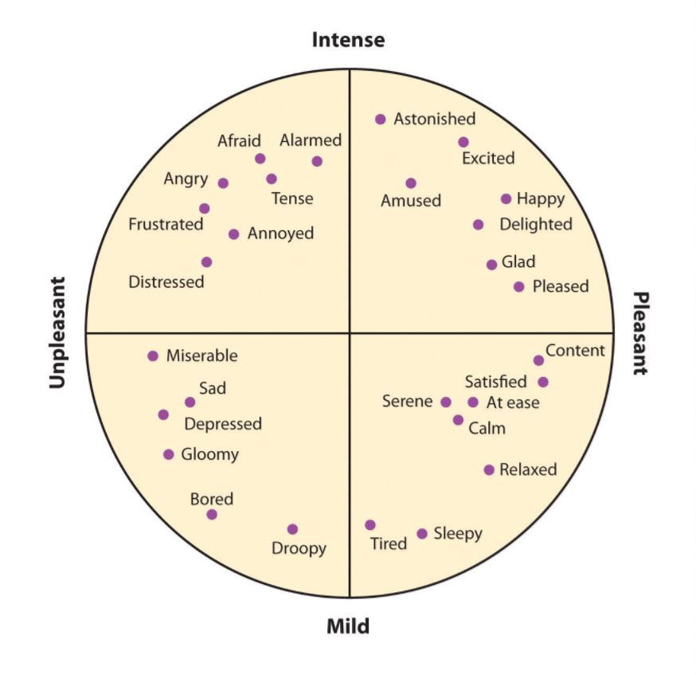
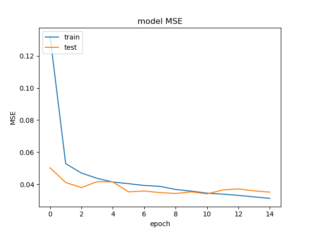
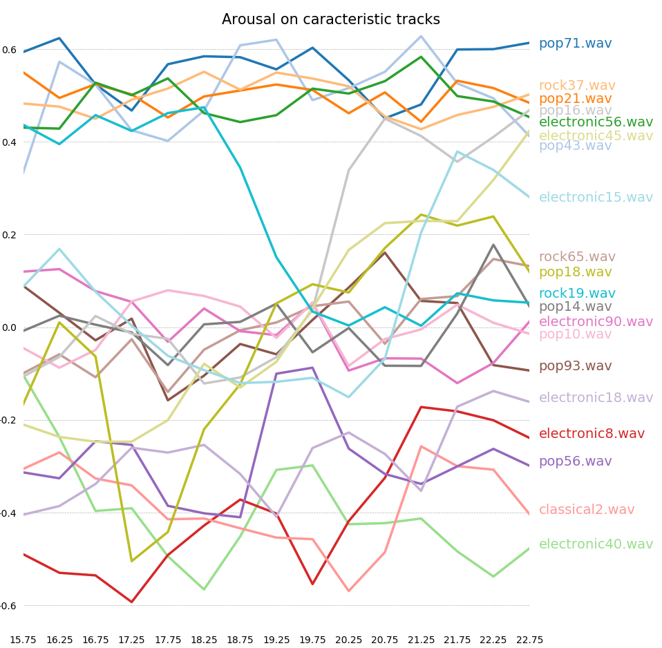

# Music Emotion Recognition on DEAM dataset, using Convolution Neural Network 



# Database presentation

For a full explanation of the dataset, refers to the article [DEAM: MediaEval Database for Emotional Analysis in Music, 2016]. 

This database links audio songs to the corresponding dynamic emotions in terms of valence and arousal.

Multiple teams tried to modelize valence and emotion based on this dataset. 

Aljani, Yang & Soleymani sums up different methodologies and results achieved until 2016 in their article [Developing a benchmark for emotional analysis of music, 2016]. 
In 2017, [Malik, Adavanne, Drossos, Virtanen, Ticha and Jarina] used CovNets to modelize emotions and achieved those scores : 
* Arousal : RMSE = 0.202 +/- 0.007
* Valence : RMSE = 0.267 +/- 0.003

Current models scores : 
* Arousal only : RMSE = 0.1876
* Valence only : RMSE = 0.2200

Models dynamic results can be seen on [this web page].

# Current methodology

## For Arousal*
From initial songs, compute the 100 first MFCCs with those parameters :

```python
sample rate = 12000
offset = 15s
Duration = 1.5s
Overlap = 2/3
Nb FFT = 512
Nb mel filters = 96
Window size = 256
```

Since the annotations are updated each 500ms, and each MFCC correspond to 1.5s sample with 2/3 overlaping,
target variable of each MFCC correspond to the mean of the values included in the window of 1.5s.

MFCCs and corresponding target variable are splited into train and test samples, stratified by song, and then randomized. 

## For Valence

Each song is splited into 500ms samples, and chromagrams are computed. It allows the network to modelize valence directly from music notes. 
LSTM are used.

# Project organisation

```shell
├── README.md
├── data
│   ├── annotations
│   │   ├── arousal.csv
│   │   └── valence.csv
│   ├── DEAM_mfccs
│   │   └── <DEAM_ID>.npy
│   └── test_songs
│       └── <SONG_ID>.wav
├── readme_files
│   ├── valence_arousal_emotions.png
│   ├── valence_arousal_emotions.jpg
│   └── valence_arousal_emotions2.jpg
├── models
│   ├── <trained models architectures>.json
│   └── <trained models weights>.h5
├── MAIN.py
├── MAIN_arousal.py
└── MAIN_valence.py
```

# Model scores

## Current model architecture : 

```python
_________________________________________________________________
Layer (type)                 Output Shape              Param #   
=================================================================
     
=================================================================
Total params: 
Trainable params: 
Non-trainable params: 
```

## Local training :

* Train set : ?? MFCCs
* Early stop : patience = 
* 24 Epochs of training achieved in ??h??
* Test set : ?? MFCCs

## Scores : 



```python
Test RMSE = 0.1878
Test accuracy: 
Sparsity : 
```

# Evaluation on external dataset



Predictions are made on another dataset : Emotivity_genre_dataset.7z, which can be found on [gs://audio_databases/], from seconds 15 to 23,5. 

[DEAM: MediaEval Database for Emotional Analysis in Music, 2016]: http://cvml.unige.ch/databases/DEAM/manual.pdf
[Developing a benchmark for emotional analysis of music, 2016]: http://journals.plos.org/plosone/article?id=10.1371/journal.pone.0173392
[Malik, Adavanne, Drossos, Virtanen, Ticha and Jarina]: https://arxiv.org/abs/1706.02292
[Sox]: http://sox.sourceforge.net/
[FFmpeg]: https://www.ffmpeg.org/
[Librosa]: https://librosa.github.io/librosa/
[gs://audio_databases/]: https://storage.cloud.google.com/audio_databases/
[gs://audio_databases/MFCCs/]: https://console.cloud.google.com/storage/browser/audio_databases/MFCCs/?project=titan-data-science&organizationId=14716331081
[gs://audio_databases/MFCCs_sample/]: https://console.cloud.google.com/storage/browser/audio_databases/MFCCs_sample/?project=titan-data-science&organizationId=14716331081
[SimpleNet]: https://arxiv.org/ftp/arxiv/papers/1608/1608.06037.pdf
[DEAM dataset]: http://cvml.unige.ch/databases/DEAM/
[gs://audio_databases/DEAM_valence_arousal.7z]: https://console.cloud.google.com/storage/browser/audio_databases/?project=titan-data-science&organizationId=14716331081
[here]: readme_files/TestSongPredicted.csv
[this web page]: https://storage.cloud.google.com/audio_databases/Visualisations/EmoReco-LegitSongs/EmoReco_BarChart_online.html?organizationId=14716331081&_ga=2.103929472.-1011907932.1494843931